**Laporan Modul 3**

- Pavita Sherintama Giantoro (1202190051)
- Rani Kusumawati (1202192029)
#
Soal praktikum dapat diakses disini [Klik disini.](https://github.com/aldonesia/Sistem-Administrasi-Server-2021/blob/master/modul-3/silabus.md)
#
- Masuk ke ~/ansible/laravel , kemudian membuat file dengan nama sublaravel.yml
  ```
  cd ~/ansible/laravel
  nano sublaravel.yml
  ```
  <p align="center">
        	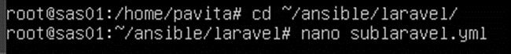
  </p>
  ```
  ---
  - hosts: all
    become : yes
    tasks:
      - name: install bind9 dan dnsutils
        apt:
         pkg:
           - bind9
           - dnsutils
  ```
- Langkah selanjutnya adalah menginstal paket dengan ansible
  <p align="center">
        	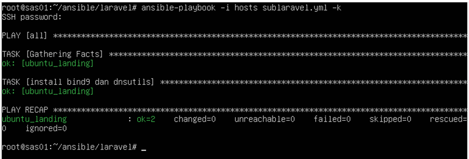
  </p>
- Buat file config1.yml
  <p align="center">
        	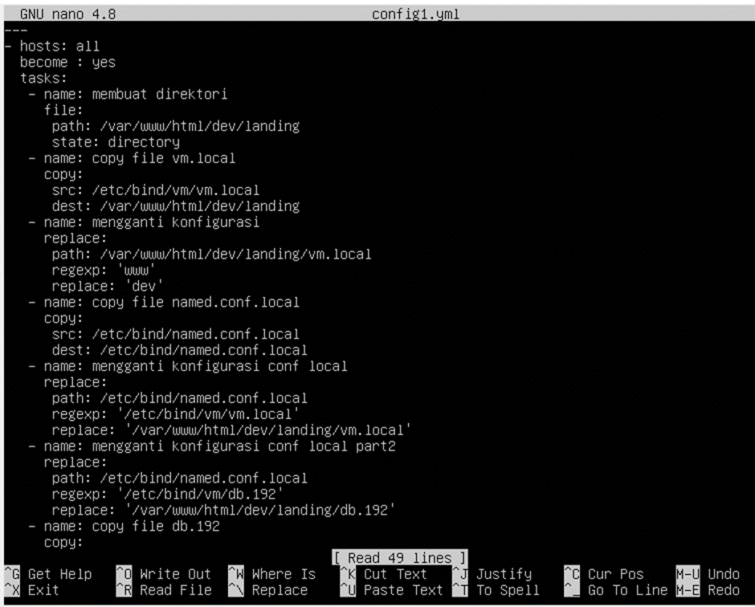
  </p>
  ```
  ---
  - hosts: all
    become : yes
    tasks:
     - name: membuat direktori
       file:
        path: /var/www/html/dev/landing
        state: directory
     - name: copy file vm.local
       copy:
        src: /etc/bind/vm/vm.local
        dest: /var/www/html/dev/landing
     - name: mengganti konfigurasi
       replace:
        path: /var/www/html/dev/landing/vm.local
        regexp: 'www'
        replace: 'dev'
     - name: copy file named.conf.local
       copy:
        src: /etc/bind/named.conf.local
        dest: /etc/bind/named.conf.local
     - name: mengganti konfigurasi conf local
       replace:
        path: /etc/bind/named.conf.local
        regexp: '/etc/bind/vm/vm.local'
        replace: '/var/www/html/dev/landing/vm.local'
     - name: mengganti konfigurasi conf local part2
       replace:
        path: /etc/bind/named.conf.local
        regexp: '/etc/bind/vm/115.168.192.in-addr.arpa'
        replace: '/var/www/html/dev/landing/115.168.192.in-addr.arpa'
     - name: copy file 115.168.192.in-addr.arpa
       copy:
        src: /etc/bind/vm/115.168.192.in-addr.arpa
        dest: /var/www/html/dev/landing
     - name: copy file resolv.conf
       copy:
        src: /etc/resolv.conf
        dest: /etc/resolv.conf
     - name: copy file named.conf.options
       copy:
        src: /etc/bind/named.conf.options
        dest: /etc/bind/named.conf.options
     - name: restart nginx
       service:
        name: nginx
        state: restarted
     - name: restart bind9
       action: service name=bind9 state=restarted
  ```
- Lakukan instalasi
  <p align="center">
        	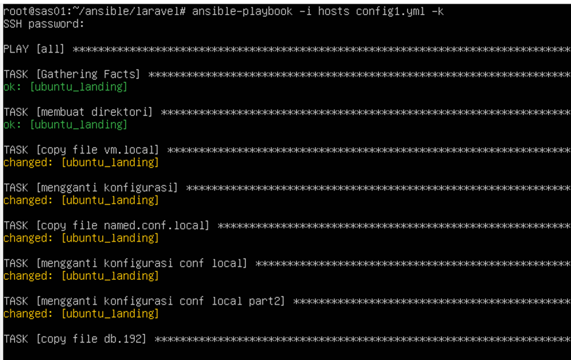
  </p>
- Menambahkan subdomain ke /etc/host
  <p align="center">
        	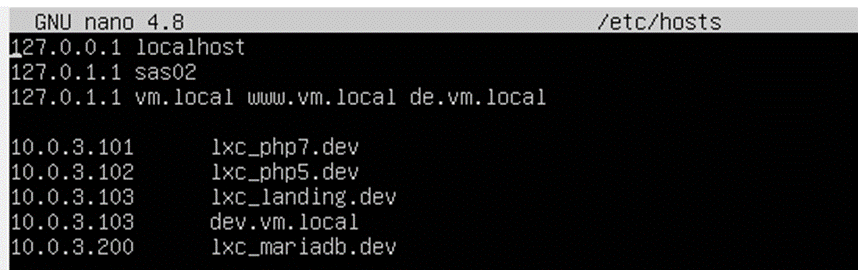
  </p>
- Buka vm.local file
  <p align="center">
        	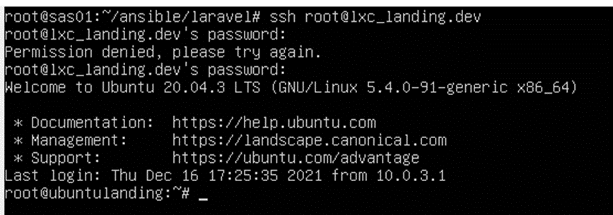
  </p>
- Tambahkan baris www. Setelah itu keluar lxc
  <p align="center">
        	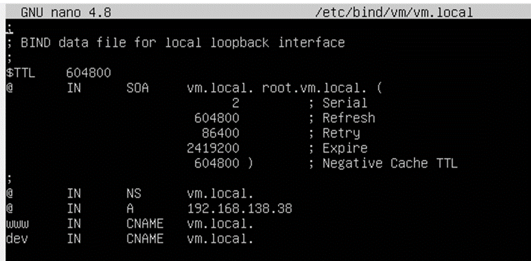
  </p>
- Membuka dan mengedit vm.local di direktori /etc/nginx/sites-enabled/
  <p align="center">
        	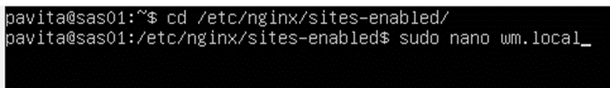
  </p>
  <p align="center">
        	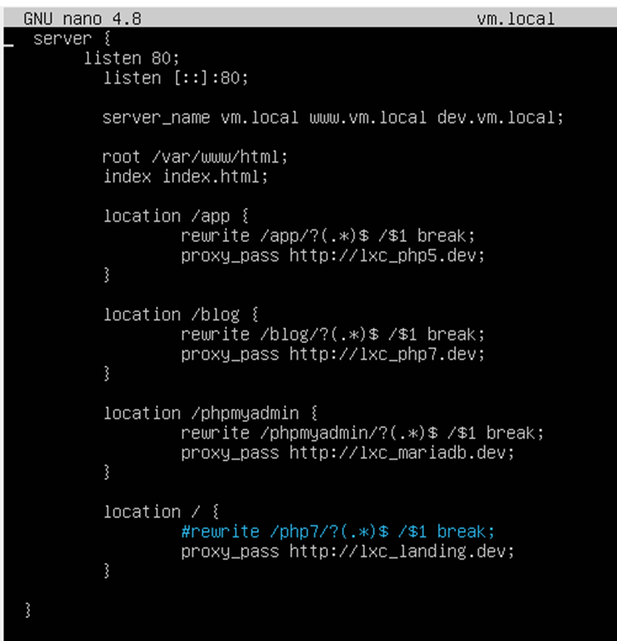
  </p>
- Membuka dan mengedit vm.local di direktori /etc/bind/vm/
  <p align="center">
        	
  </p>
- Mulai ulang semua paket
  <p align="center">
        	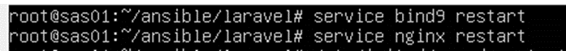
  </p>
- Buka Pengaturan Wifi, tambahkan server dns
  <p align="center">
        	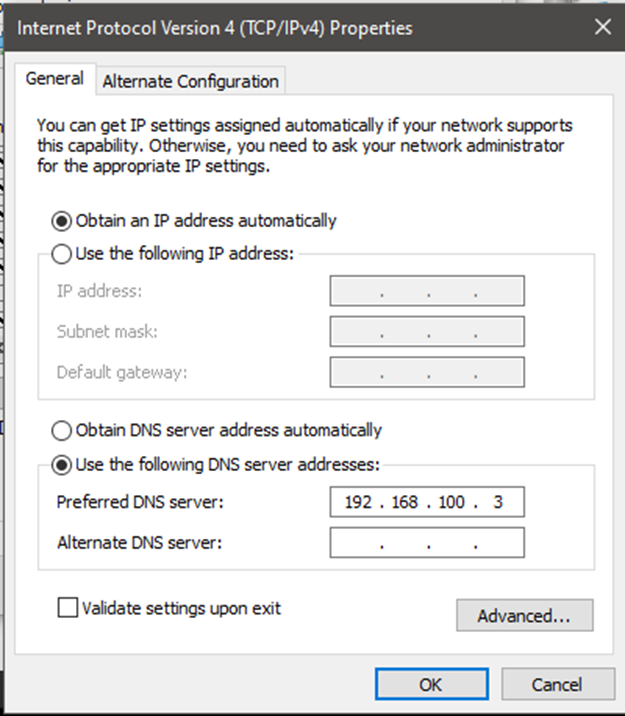
  </p>
- Hasil
  <p align="center">
        	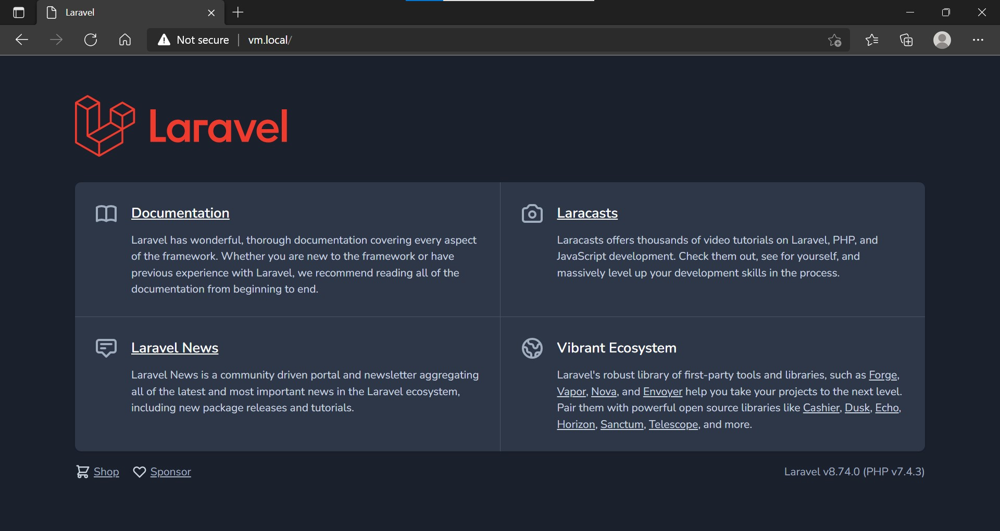
  </p>
