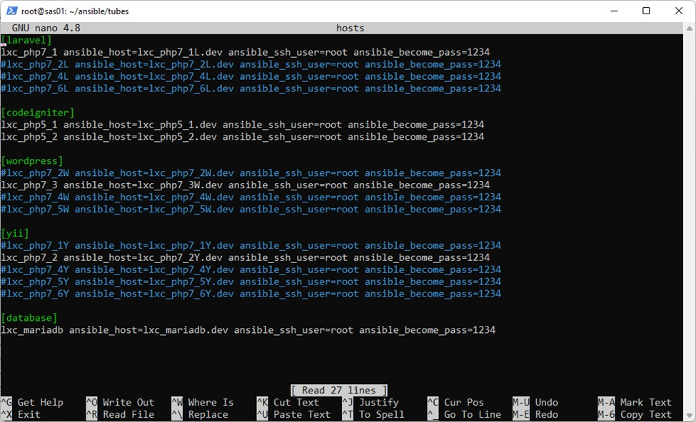
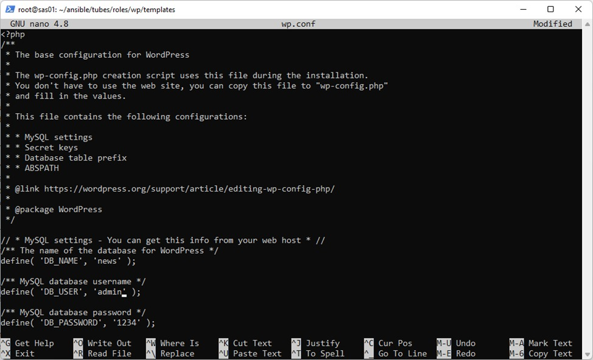

## UAS 
- Pavita Sherintama Giantoro (1202190051)
- Rani Kusumawati (1202192029)
---

- Buat LXC yang terdiri dari 6 LXC ubuntu, 2 LXC debian PHP, dan 1 LXC debian mariadb. Setting autostart dan IP setiap LXC
  <p align="center">
        	
  </p>
- Setting hosts ansible
  <p align="center">
        	
  </p>
- Buat folder tubes pada ~/ansible
  <p align="center">
        	
  </p>
  <p align="center">
        	
  </p>
- Buat beberapa file pada folder ~/ansible/tubes
  <p align="center">
        	
  </p>
  <p align="center">
        	
  </p>
  <p align="center">
        	
  </p>
  <p align="center">
        	
  </p>
- r
  <p align="center">
        	
  </p>
  <p align="center">
        	
  </p>
  <p align="center">
        	
  </p>
  <p align="center">
        	
  </p>
  <p align="center">
        	
  </p>
  <p align="center">
        	
  </p>
  <p align="center">
        	
  </p>
  <p align="center">
        	
  </p>
  <p align="center">
        	
  </p>
  <p align="center">
        	
  </p>
  <p align="center">
        	
  </p>
  <p align="center">
        	
  </p>
  <p align="center">
        	
  </p>
  <p align="center">
        	
  </p>
  <p align="center">
        	
  </p>
  <p align="center">
        	
  </p>
  <p align="center">
        	
  </p>
  <p align="center">
        	
  </p>
  <p align="center">
        	
  </p>
  <p align="center">
        	
  </p>
  <p align="center">
        	
  </p>
  <p align="center">
        	
  </p>
  <p align="center">
        	
  </p>
  <p align="center">
        	
  </p>
- atur IP statis dan install server ssh di setiap lxc

- `sudo nano /etc/hosts`

- buat folder di direktori ansibel sudo `mkdir -p ~/ansible/tubes`


- buat roles directory untuk menampung skript yang akan diinstall

- buat direktori laravel untuk menginstall laravel framework `sudo mkdir laravel`

- bikin 3 folder yaitu tasks, handlers, dan templates

  ```
  sudo mkdir -p laravel/tasks
  sudo mkdir -p laravel/handlers
  sudo mkdir -p laravel/templates
  ```

  

- buat file main.yml pada task dan ketik script dibawah ini

  ```
  ---
  - name: delete apt chache
    become: yes
    become_user: root
    become_method: su
    command: rm -vf /var/lib/apt/lists/*
  
  - name: Download and install Composer
    shell: curl -sS https://getcomposer.org/installer | php
    args:
      chdir: /usr/src/
      creates: /usr/local/bin/composer
      warn: false
    become: yes
  
  - name: Add Composer to global path
    copy:
      dest: /usr/local/bin/composer
      group: root
      mode: '0755'
      owner: root
      src: /usr/src/composer.phar
      remote_src: yes
    become: yes
  
  - name: Ansible delete file create-project
    file:
      path: /var/www/html/laravel
      state: absent
  
  - name: composer create-project
    shell: /usr/local/bin/composer create-project laravel/laravel /var/www/html/laravel --prefer-dist --no-interaction
  
  - name: Copy .env.template
    template:
      src=templates/env.template
      dest=/var/www/html/laravel/.env
  
  - name: composer
    shell: cd /var/www/html/laravel; /usr/local/bin/composer install  --no-interaction
  
  - name: key
    shell: /usr/bin/php7.4 /var/www/html/laravel/artisan key:generate
  
  - name: chmod
    become: yes
    become_user: root
    become_method: su
    command: chmod 777 -R /var/www/html/laravel/storage
  
  - name: Copy lv.conf
    template:
      src=templates/lv.conf
      dest=/etc/nginx/sites-available/{{ domain }}
    vars:
      servername: '{{ domain }}'
  
  - name: copy php7.conf
    template:
      src=templates/php7.conf
      dest=/etc/php/7.4/fpm/pool.d/www.conf
  
  - name: Symlink lv.conf
    command: ln -sfn /etc/nginx/sites-available/{{ domain }} /etc/nginx/sites-enabled/{{ domain }}
    notify:
      - restart nginx
  
  - name: Write {{ domain }} to /etc/hosts
    lineinfile:
      dest: /etc/hosts
      regexp: '.*{{ domain }}$'
      line: "127.0.0.1 {{ domain }}"
      state: present
  ```

  

- buat file main.yml pada handler dan ketik script di bawah

  ```
  ---
  - name: restart php
    become: yes
    become_user: root
    become_method: su
    action: service name=php7.4-fpm state=restarted
  
  - name: restart nginx
    become: yes
    become_user: root
    become_method: su
    action: service name=nginx state=restarted
  ```

  

- buat 3 file script pada templates

  1. env.templates


  2. lv.conf


  3. php7.conf


- buat folder php dan bikin 2 direktori bernaa task dan handler

- buat file main.yml pada task dan ketik script di bawah

  ```
  ---
  - name: delete apt chache
    become: yes
    become_user: root
    become_method: su
    command: rm -vf /var/lib/apt/lists/*
  
  - name: install php
    become: yes
    become_user: root
    become_method: su
    apt: name={{ item }} state=latest update_cache=true
    with_items:
      - gtkhash
      - crack-md5
      - git
      - curl
      - nginx
      - nginx-extras
      - php7.4
      - php7.4-fpm
      - php7.4-curl
      - php7.4-xml
      - php7.4-gd
      - php7.4-opcache
      - php7.4-mbstring
      - php7.4-zip
      - php7.4-json
      - php7.4-cli
  
  - name: enable module php mbstring
    command: phpenmod mbstring
    notify:
      - restart php
  ```

  

- buat file main.yml pada handlers dan ketik script di bawah

  ```
  ---
  - name: restart php
    become: yes
    become_user: root
    become_method: su
    action: service name=php7.4-fpm state=restarted
  
  - name: restart nginx
    become: yes
    become_user: root
    become_method: su
    action: service name=nginx state=restarted
  ```

  

- buat direktori codeigniter `sudo mkdir codeigniter`

- buat folder tasks, handlers, dan templates

  ```
  sudo mkdir -p codeigniter/tasks
  sudo mkdir -p codeigniter/handlers
  sudo mkdir -p codeigniter/templates
  ```

  

- buat file main.yml pada tasks dan ketik script di bawah

  ```
  ---
  - name: delete apt chache
    become: yes
    become_user: root
    become_method: su
    command: rm -vf /var/lib/apt/lists/*
  
  - name: install requirement dpkg to install php5
    become: yes
    become_user: root
    become_method: su
    apt: name={{ item }} state=latest update_cache=true
    with_items:
      - ca-certificates
      - apt-transport-https
      - wget
      - curl
      - python-apt
      - software-properties-common
      - git
  
  - name: Add key
    apt_key:
      url: https://packages.sury.org/php/apt.gpg
      state: present
  
  - name: Add Php Repository
    apt_repository:
        repo: "deb https://packages.sury.org/php/ stretch main"
        state: present
        filename: php.list
        update_cache: true
  
  - name: wget repository
    shell: wget -O /etc/apt/trusted.gpg.d/php.gpg https://packages.sury.org/php/apt.gpg
  
  - name: add repository
    shell: echo "deb https://packages.sury.org/php/ $(lsb_release -sc) main" | tee /etc/apt/sources.list.d/php.list
  
  - name: apt update
    shell: apt update
  
  - name: install nginx php5
    become: yes
    become_user: root
    become_method: su
    apt: name={{ item }} state=latest update_cache=true
    with_items:
      - nginx
      - nginx-extras
      - php5.6
      - php5.6-fpm
      - php5.6-common
      - php5.6-cli
      - php5.6-curl
      - php5.6-mbstring
      - php5.6-mysqlnd
      - php5.6-xml
  
  - name: Git clone repo sas-ci
    become: yes
    git:
      repo: '{{ git_url }}'
      dest: "{{ destdir }}"
  
  - name: Copy app.conf
    template:
      src=templates/app.conf
      dest=/etc/nginx/sites-available/{{ domain }}
    vars:
      servername: '{{ domain }}'
  
  - name: Delete another nginx config
    become: yes
    become_user: root
    become_method: su
    command: rm -f /etc/nginx/sites-enabled/*
  
  - name: Symlink app.conf
    command: ln -sfn /etc/nginx/sites-available/{{ domain }} /etc/nginx/sites-enabled/{{ domain }}
    notify:
      - restart nginx
  
  - name: Write {{ domain }} to /etc/hosts
    lineinfile:
      dest: /etc/hosts
      regexp: '.*{{ domain }}$'
      line: "127.0.0.1 {{ domain }}"
      state: present
  ```

  

- buat file main.yml pada handlers dan ketik script di bawah

  ```
  ---
  - name: restart nginx
    become: yes
    become_user: root
    become_method: su
    action: service name=nginx state=restarted
  
  - name: restart php
    become: yes
    become_user: root
    become_method: su
    action: service name=php5.6-fpm state=restarted
  ```

  

- buat file app.conf pada templates dan ketik script di bawah

  ```
  server {
    listen 80;
    server_name {{ domain }};
    root {{ destdir }};
    index index.php;
    location / {
       try_files $uri $uri/ /index.php?$query_string;
    }
    location ~ \.php$ {
       fastcgi_pass unix:/run/php/php5.6-fpm.sock;  #Sesuaikan dengan versi PHP
       fastcgi_index index.php;
       fastcgi_param SCRIPT_FILENAME {{ destdir }}$fastcgi_script_name;
       include fastcgi_params;
    }
  }
  ```

  

- Buat direktori db `sudo mkdir db`. dan buat 3 folder untuk menampung tasks, hadlers, dan templates

  ```
  sudo mkdir -p db/tasks
  sudo mkdir -p db/handlers
  sudo mkdir -p db/templates
  ```

  

- Buat file main.yml pada folder tasks dan ketik script di bawah

  ```
  ---
  - name: delete apt chache
    become: yes
    become_user: root
    become_method: su
    command: rm -vf /var/lib/apt/lists/*
  
  - name: Download and install Composer
    shell: curl -sS https://getcomposer.org/installer | php
    args:
      chdir: /usr/src/
      creates: /usr/local/bin/composer
      warn: false
    become: yes
  
  - name: Add Composer to global path
    copy:
      dest: /usr/local/bin/composer
      group: root
      mode: '0755'
      owner: root
      src: /usr/src/composer.phar
      remote_src: yes
    become: yes
  
  - name: Ansible delete file create-project
    file:
      path: /var/www/html/laravel
      state: absent
  
  - name: composer create-project
    shell: /usr/local/bin/composer create-project laravel/laravel /var/www/html/laravel --prefer-dist --no-interaction
  
  - name: Copy .env.template
    template:
      src=templates/env.template
      dest=/var/www/html/laravel/.env
  
  - name: composer
    shell: cd /var/www/html/laravel; /usr/local/bin/composer install  --no-interaction
  
  - name: key
    shell: /usr/bin/php7.4 /var/www/html/laravel/artisan key:generate
  
  - name: chmod
    become: yes
    become_user: root
    become_method: su
    command: chmod 777 -R /var/www/html/laravel/storage
  
  - name: Copy lv.conf
    template:
      src=templates/lv.conf
      dest=/etc/nginx/sites-available/{{ domain }}
    vars:
      servername: '{{ domain }}'
  
  - name: copy php7.conf
    template:
      src=templates/php7.conf
      dest=/etc/php/7.4/fpm/pool.d/www.conf
  
  - name: Symlink lv.conf
    command: ln -sfn /etc/nginx/sites-available/{{ domain }} /etc/nginx/sites-enabled/{{ domain }}
    notify:
      - restart nginx
  
  - name: Write {{ domain }} to /etc/hosts
    lineinfile:
      dest: /etc/hosts
      regexp: '.*{{ domain }}$'
      line: "127.0.0.1 {{ domain }}"
      state: present
  ```

  

- Buat file main.yml pada folder handlers dan ketik script di bawah

  ```
  ---
  - name: restart mysql
    become: yes
    become_user: root
    become_method: su
    action: service name=mysql state=restarted
  ```

  

- Buat file my.cnf pada folder templates dan ketik script di bawah

  ```
  #
  # These groups are read by MariaDB server.
  # Use it for options that only the server (but not clients) should see
  #
  # See the examples of server my.cnf files in /usr/share/mysql/
  #
  
  # this is read by the standalone daemon and embedded servers
  [server]
  
  # this is only for the mysqld standalone daemon
  [mysqld]
  
  #
  # * Basic Settings
  #
  user            = mysql
  pid-file        = /var/run/mysqld/mysqld.pid
  socket          = /var/run/mysqld/mysqld.sock
  port            = 3306
  basedir         = /usr
  datadir         = /var/lib/mysql
  tmpdir          = /tmp
  lc-messages-dir = /usr/share/mysql
  skip-external-locking
  
  # Instead of skip-networking the default is now to listen only on
  # localhost which is more compatible and is not less secure.
  bind-address            = 0.0.0.0
  
  #
  # * Fine Tuning
  #
  key_buffer_size         = 16M
  max_allowed_packet      = 16M
  thread_stack            = 192K
  thread_cache_size       = 8
  # This replaces the startup script and checks MyISAM tables if needed
  # the first time they are touched
  myisam_recover_options  = BACKUP
  #max_connections        = 100
  #table_cache            = 64
  #thread_concurrency     = 10
  
  #
  # * Query Cache Configuration
  #
  query_cache_limit       = 1M
  query_cache_size        = 16M
  
  #
  # * Logging and Replication
  #
  # Both location gets rotated by the cronjob.
  # Be aware that this log type is a performance killer.
  # As of 5.1 you can enable the log at runtime!
  #general_log_file        = /var/log/mysql/mysql.log
  #general_log             = 1
  #
  # Error log - should be very few entries.
  #
  log_error = /var/log/mysql/error.log
  #
  # Enable the slow query log to see queries with especially long duration
  #slow_query_log_file    = /var/log/mysql/mariadb-slow.log
  #long_query_time = 10
  #log_slow_rate_limit    = 1000
  #log_slow_verbosity     = query_plan
  #log-queries-not-using-indexes
  #
  # The following can be used as easy to replay backup logs or for replication.
  # note: if you are setting up a replication slave, see README.Debian about
  #       other settings you may need to change.
  #server-id              = 1
  #log_bin                        = /var/log/mysql/mysql-bin.log
  expire_logs_days        = 10
  max_binlog_size   = 100M
  #binlog_do_db           = include_database_name
  #binlog_ignore_db       = exclude_database_name
  
  #
  # * InnoDB
  #
  # InnoDB is enabled by default with a 10MB datafile in /var/lib/mysql/.
  # Read the manual for more InnoDB related options. There are many!
  
  #
  # * Security Features
  #
  # Read the manual, too, if you want chroot!
  # chroot = /var/lib/mysql/
  #
  # For generating SSL certificates you can use for example the GUI tool "tinyca".
  #
  # ssl-ca=/etc/mysql/cacert.pem
  # ssl-cert=/etc/mysql/server-cert.pem
  # ssl-key=/etc/mysql/server-key.pem
  #
  # Accept only connections using the latest and most secure TLS protocol version.
  # ..when MariaDB is compiled with OpenSSL:
  # ssl-cipher=TLSv1.2
  # ..when MariaDB is compiled with YaSSL (default in Debian):
  # ssl=on
  
  #
  # * Character sets
  #
  # MySQL/MariaDB default is Latin1, but in Debian we rather default to the full
  # utf8 4-byte character set. See also client.cnf
  #
  character-set-server  = utf8mb4
  collation-server      = utf8mb4_general_ci
  
  #
  # * Unix socket authentication plugin is built-in since 10.0.22-6
  #
  # Needed so the root database user can authenticate without a password but
  # only when running as the unix root user.
  #
  # Also available for other users if required.
  # See https://mariadb.com/kb/en/unix_socket-authentication-plugin/
  
  # this is only for embedded server
  [embedded]
  
  # This group is only read by MariaDB servers, not by MySQL.
  # If you use the same .cnf file for MySQL and MariaDB,
  # you can put MariaDB-only options here
  [mariadb]
  ```

  

- buat folder pma dan buat 3 direktori bernama tasks, handlers, dan templates.

- buat file main.yml pada direktori tasks dan ketik script di bawah

  ```
  ---
  - name: delete apt chache
    become: yes
    become_user: root
    become_method: su
    command: rm -vf /var/lib/apt/lists/*
  
  - name: install requirement dpkg to install php5
    become: yes
    become_user: root
    become_method: su
    apt: name={{ item }} state=latest update_cache=true
    with_items:
      - ca-certificates
      - apt-transport-https
      - wget
      - curl
      - python-apt
      - software-properties-common
      - git
  
  - name: Add key
    apt_key:
      url: https://packages.sury.org/php/apt.gpg
      state: present
  
  - name: Add Php Repository
    apt_repository:
        repo: "deb https://packages.sury.org/php/ stretch main"
        state: present
        filename: php.list
        update_cache: true
  - name: wget repository php
    shell: wget -O /etc/apt/trusted.gpg.d/php.gpg https://packages.sury.org/php/apt.gpg
  
  - name: add repository php
    shell: echo "deb https://packages.sury.org/php/ $(lsb_release -sc) main" | tee /etc/apt/sources.list.d/php.list
  
  - name: wget repository
    shell: wget https://files.phpmyadmin.net/phpMyAdmin/5.1.1/phpMyAdmin-5.1.1-all-languages.tar.gz
  
  - name: tar phpmyadmin
    shell: tar -zxvf phpMyAdmin-5.1.1-all-languages.tar.gz
  
  - name: move phpmyadmin
    shell: mv phpMyAdmin-5.1.1-all-languages /usr/share/phpMyAdmin
  
  - name: apt update
    shell: apt update
  
  - name: install nginx phpmyadmin
    become: yes
    become_user: root
    become_method: su
    apt: name={{ item }} state=latest update_cache=true
    with_items:
      - curl
      - nginx
      - nginx-extras
      - php7.2-fpm
      - php7.2-mysqli
      - php7.2-xml
      - php-mbstring
      - php-zip
      - php-gd
      - php-json
      - php-curl
  - name: enable module php mbstring
    command: phpenmod mbstring
    notify:
      - restart php
  
  - name: Copy pma.local
    template:
      src=templates/pma.local
      dest=/etc/nginx/sites-available/{{ domain }}
    vars:
      servername: '{{ domain }}'
  
  - name: Symlink pma.local
    command: ln -sfn /etc/nginx/sites-available/{{ domain }} /etc/nginx/sites-enabled/{{ domain }}
    notify:
      - restart nginx
  
  - name: Write {{ domain }} to /etc/hosts
    lineinfile:
      dest: /etc/hosts
      regexp: '.*{{ domain }}$'
      line: "127.0.0.1 {{ domain }}"
      state: present
  ```

  

- buat file main.yml pada direktori handlers dan ketik script di bawah

  ```
  ---
  - name: stop apache2
    become: yes
    become_user: root
    become_method: su
    action: service name=apache2 state=stopped
  
  - name: restart nginx
    become: yes
    become_user: root
    become_method: su
    action: service name=nginx state=restarted
  
  - name: restart php
    become: yes
    become_user: root
    become_method: su
    action: service name=php7.2-fpm state=restarted
  ```

  

- buat file pma.local pada direktori tasks dan ketik script di bawah

  ```
  server {
      listen 80;
  
        server_name {{ domain }};
  
        root /usr/share/phpMyAdmin;
  
        index index.php;
  
        location / {
  
             try_files $uri $uri/ @phpmyadmin;
  
        }
        location @phpmyadmin {
                fastcgi_pass unix:/run/php/php7.2-fpm.sock;   #Sesuaikan dengan versi PHP
  
                fastcgi_param SCRIPT_FILENAME /usr/share/phpMyAdmin/index.php;
  
                include /etc/nginx/fastcgi_params;
  
                fastcgi_param SCRIPT_NAME /index.php;
        }
        location ~ \.php$ {
  
                fastcgi_pass unix:/run/php/php7.2-fpm.sock;  #Sesuaikan dengan versi PHP
  
                fastcgi_index index.php;
  
                fastcgi_param SCRIPT_FILENAME /usr/share/phpMyAdmin$fastcgi_script_name;
  
                include fastcgi_params;
  
        }
    }
  ```

  

- buat direktori wordpress `sudo mkdir wordpress` dan buat 3 folder berupa tasks, handlers, dan templates

  ```
  sudo mkdir -p wordpress /tasks
  sudo mkdir -p wordpress /handlers
  sudo mkdir -p wordpress /templates
  ```

  

- buat file main.yml pada folder tasks dan ketik scrpt di bawah 

  ```
  ---
  - name: delete apt chache
    become: yes
    become_user: root
    become_method: su
    command: rm -vf /var/lib/apt/lists/*
  
  - name: install requirement
    become: yes
    become_user: root
    become_method: su
    apt: name={{ item }} state=latest update_cache=true
    with_items:
      - nginx
      - nginx-extras
      - curl
      - wget
      - php7.4
      - php7.4-fpm
      - php7.4-curl
      - php7.4-xml
      - php7.4-gd
      - php7.4-opcache
      - php7.4-mbstring
      - php7.4-zip
      - php7.4-json
      - php7.4-cli
      - php7.4-mysqlnd
      - php7.4-xmlrpc
      - php7.4-curl
  
  - name: wget wordpress
    shell: wget -c http://wordpress.org/latest.tar.gz
  
  - name: tar latest.tar.gz
    shell: tar -xvzf latest.tar.gz
  
  - name: copy folder wordpress
    shell: cp -R wordpress /var/www/html/blog
  
  - name: chmod
    become: yes
    become_user: root
    become_method: su
    command: chmod 775 -R /var/www/html/blog/
  
  - name: copy .wp-config.conf
    template:
      src=templates/wp.conf
      dest=/var/www/html/blog/wp-config.php
  
  - name: copy php7.conf
    template:
      src=templates/php7.conf
      dest=/etc/php/7.4/fpm/pool.d/www.conf
  
  - name: copy wordpress.conf
    template:
      src=templates/wordpress.conf
      dest=/etc/nginx/sites-available/{{ domain }}
    vars:
      servername: '{{ domain }}'
  
  - name: Symlink wordpress.conf
    command: ln -sfn /etc/nginx/sites-available/{{ domain }} /etc/nginx/sites-enabled/{{ domain }}
    notify:
      - restart nginx
  
  - name: Write {{ domain }} to /etc/hosts
    lineinfile:
      dest: /etc/hosts
      regexp: '.*{{ domain }}$'
      line: "127.0.0.1 {{ domain }}"
      state: present
  
  - name: enable module php mbstring
    command: phpenmod mbstring
    notify:
      - restart php
  ```

  

- buat file main.yml pada folder handlers dan ketik scrpt di bawah 

  ```
  ---
  - name: restart nginx
    become: yes
    become_user: root
    become_method: su
    action: service name=nginx state=restarted
  
  - name: restart php
    become: yes
    become_user: root
    become_method: su
    action: service name=php7.4-fpm state=restarted
  ```

  

- pada folder templates, buat 3 script di bawah 

  1.  php7.conf


  2. wordpress.conf

     ```
     server {
          listen 80;
          listen [::]:80;
     
          # Log files for Debugging
          access_log /var/log/nginx/wordpress-access.log;
          error_log /var/log/nginx/wordpress-error.log;
     
          # Webroot Directory for Laravel project
          root /var/www/html/wordpress;
          index index.php index.html index.htm;
     
          # Your Domain Name
          server_name {{ domain }};
     
          location / {
                  try_files $uri $uri/ /index.php?$query_string;
          }
     
          # PHP-FPM Configuration Nginx
          location ~ \.php$ {
                  try_files $uri =404;
                  fastcgi_split_path_info ^(.+\.php)(/.+)$;
                  fastcgi_pass 127.0.0.1:9001;
                  fastcgi_index index.php;
                  fastcgi_param SCRIPT_FILENAME $document_root$fastcgi_script_name;
                  include fastcgi_params;
          }
     }
     ```

     

  3. wp.conf

     ```
     <?php
     /**
      * The base configuration for WordPress
      *
      * The wp-config.php creation script uses this file during the installation.
      * You don't have to use the web site, you can copy this file to "wp-config.php"
      * and fill in the values.
      *
      * This file contains the following configurations:
      *
      * * MySQL settings
      * * Secret keys
      * * Database table prefix
      * * ABSPATH
      *
      * @link https://wordpress.org/support/article/editing-wp-config-php/
      *
      * @package WordPress
      */
     
     define( 'WP_HOME', 'http://news.kelompok3.fpsas' );
     define( 'WP_SITEURL', 'http://news.kelompok3.fpsas' );
     
     // ** MySQL settings - You can get this info from your web host ** //
     /** The name of the database for WordPress */
     define( 'DB_NAME', 'blog' );
     
     /** MySQL database username */
     define( 'DB_USER', 'arafah' );
     
     /** MySQL database password */
     define( 'DB_PASSWORD', '1234' );
     
     /** MySQL hostname */
     define( 'DB_HOST', '10.0.3.100:3306' );
     /** Database charset to use in creating database tables. */
     define( 'DB_CHARSET', 'utf8' );
     
     /** The database collate type. Don't change this if in doubt. */
     define( 'DB_COLLATE', '' );
     
     /**#@+
      * Authentication unique keys and salts.
      *
      * Change these to different unique phrases! You can generate these using
      * the {@link https://api.wordpress.org/secret-key/1.1/salt/ WordPress.org secret-key service}.
      *
      * You can change these at any point in time to invalidate all existing cookies.
      * This will force all users to have to log in again.
      *
      * @since 2.6.0
      */
     define( 'AUTH_KEY',         'put your unique phrase here' );
     define( 'SECURE_AUTH_KEY',  'put your unique phrase here' );
     define( 'LOGGED_IN_KEY',    'put your unique phrase here' );
     define( 'NONCE_KEY',        'put your unique phrase here' );
     define( 'AUTH_SALT',        'put your unique phrase here' );
     define( 'SECURE_AUTH_SALT', 'put your unique phrase here' );
     define( 'LOGGED_IN_SALT',   'put your unique phrase here' );
     define( 'NONCE_SALT',       'put your unique phrase here' );
     
     /**#@-*/
     
     /**
      * WordPress database table prefix.
      *
      * You can have multiple installations in one database if you give each
      * a unique prefix. Only numbers, letters, and underscores please!
      */
     $table_prefix = 'wp_';
     /**
      * For developers: WordPress debugging mode.
      *
      * Change this to true to enable the display of notices during development.
      * It is strongly recommended that plugin and theme developers use WP_DEBUG
      * in their development environments.
      *
      * For information on other constants that can be used for debugging,
      * visit the documentation.
      *
      * @link https://wordpress.org/support/article/debugging-in-wordpress/
      */
     define( 'WP_DEBUG', false );
     
     /* Add any custom values between this line and the "stop editing" line. */
     
     
     
     /* That's all, stop editing! Happy publishing. */
     
     /** Absolute path to the WordPress directory. */
     if ( ! defined( 'ABSPATH' ) ) {
             define( 'ABSPATH', __DIR__ . '/' );
     }
     
     /** Sets up WordPress vars and included files. */
     require_once ABSPATH . 'wp-settings.php';
     ```

     

     

- buat direktori yii `sudo mkdir yii` buat 3 folder yaitu tasks, handlers, dan templates

  ```
  sudo mkdir -p yii /tasks
  sudo mkdir -p yii /handlers
  sudo mkdir -p yii /templates
  ```

  

- buat file main.yml pada folder tasks. ketik script di bawah

  ```
  ---
  - name: delete apt chache
    become: yes
    become_user: root
    become_method: su
    command: rm -vf /var/lib/apt/lists/*
  
  - name: Download and install Composer
    shell: curl -sS https://getcomposer.org/installer | php
    args:
      chdir: /usr/src/
      creates: /usr/local/bin/composer
      warn: false
    become: yes
  
  - name: Add Composer to global path
    copy:
      dest: /usr/local/bin/composer
      group: root
      mode: '0755'
      owner: root
      src: /usr/src/composer.phar
      remote_src: yes
    become: yes
  
  - name: Ansible delete file create-project
    file:
      path: /var/www/html/basic
      state: absent
  
  - name: composer create-project
    shell: /usr/local/bin/composer create-project yiisoft/yii2-app-basic  /var/www/html/basic --prefer-dist --no-interaction
  
  - name: chmod
    become: yes
    become_user: root
    become_method: su
    command: chmod +x /usr/local/bin/composer
  
  - name: composer
    shell: cd /var/www/html/basic; /usr/local/bin/composer install  --no-interaction
  
  
  - name: Copy yii.conf
    template:
      src=templates/yii.conf
      dest=/etc/nginx/sites-available/{{ domain }}
    vars:
      servername: '{{ domain }}'
  
  - name: Symlink yii.conf
    command: ln -sfn /etc/nginx/sites-available/{{ domain }} /etc/nginx/sites-enabled/{{ domain }}
    notify:
      - restart nginx
  
  - name: Write {{ domain }} to /etc/hosts
    lineinfile:
      dest: /etc/hosts
      regexp: '.*{{ domain }}$'
      line: "127.0.0.1 {{ domain }}"
      state: present
  ```

  

- buat file main.yml pada folder handlers. ketik script di bawah 

  ```
  ---
  - name: restart php
    become: yes
    become_user: root
    become_method: su
    action: service name=php7.4-fpm state=restarted
  
  - name: restart nginx
    become: yes
    become_user: root
    become_method: su
    action: service name=nginx state=restarted
  ```

  

- buat file yii.conf pada folder templates. ketik script di bawah

  ```
  server {
      set $host_path "/var/www/html/basic";
      #access_log  /www/testproject/log/access.log  main;
  
      server_name  {{ domain }};
      root   $host_path/web;
      set $yii_bootstrap "index.php";
  
      charset utf-8;
  
      location / {
          index  index.html $yii_bootstrap;
          try_files $uri $uri/ /$yii_bootstrap?$args;
      }
  
      location ~ ^/(protected|framework|themes/\w+/views) {
          deny  all;
      }
  
      #avoid processing of calls to unexisting static files by yii
      location ~ \.(js|css|png|jpg|gif|swf|ico|pdf|mov|fla|zip|rar)$ {
          try_files $uri =404;
      }
  
      # pass the PHP scripts to FastCGI server listening on UNIX socket
      location ~ \.php {
          fastcgi_split_path_info  ^(.+\.php)(.*)$;
  
          #let yii catch the calls to unexising PHP files
          set $fsn /$yii_bootstrap;
          if (-f $document_root$fastcgi_script_name){
              set $fsn $fastcgi_script_name;
          }
         fastcgi_pass   unix:/run/php/php7.4-fpm.sock;
          include fastcgi_params;
          fastcgi_param  SCRIPT_FILENAME  $document_root$fsn;
  
         #PATH_INFO and PATH_TRANSLATED can be omitted, but RFC 3875 specifies them for CGI
          fastcgi_param  PATH_INFO        $fastcgi_path_info;
          fastcgi_param  PATH_TRANSLATED  $document_root$fsn;
      }
  
      # prevent nginx from serving dotfiles (.htaccess, .svn, .git, etc.)
      location ~ /\. {
          deny all;
          access_log off;
          log_not_found off;
      }
  }
  ```

  

- Buat file hosts `nano hosts` dan ketik script di bawah

  ```
  [laravel]
  laravel ansible_host=lxc_laravel.dev ansible_ssh_user=root ansible_become_pass=1234
  lxc_php7_1L ansible_host=lxc_php7_1L.dev ansible_ssh_user=root ansible_become_pass=1234
  lxc_php7_2L ansible_host=lxc_php7_2L.dev ansible_ssh_user=root ansible_become_pass=1234
  lxc_php7_4L ansible_host=lxc_php7_4L.dev ansible_ssh_user=root ansible_become_pass=1234
  lxc_php7_6L ansible_host=lxc_php7_6L.dev ansible_ssh_user=root ansible_become_pass=1234
  
  [codeigniter]
  codeigniter ansible_host=lxc_codeigniter.dev ansible_ssh_user=root ansible_become_pass=1234
  lxc_php5_1 ansible_host=lxc_php5_1.dev ansible_ssh_user=root ansible_become_pass=1234
  lxc_php5_2 ansible_host=lxc_php5_2.dev ansible_ssh_user=root ansible_become_pass=1234
  
  [wordpress]
  wordpress ansible_host=lxc_wordpress.dev ansible_ssh_user=root ansible_become_pass=1234
  lxc_php7_2W ansible_host=lxc_php7_2W.dev ansible_ssh_user=root ansible_become_pass=1234
  lxc_php7_3W ansible_host=lxc_php7_3W.dev ansible_ssh_user=root ansible_become_pass=1234
  lxc_php7_4W ansible_host=lxc_php7_4W.dev ansible_ssh_user=root ansible_become_pass=1234
  lxc_php7_5W ansible_host=lxc_php7_5W.dev ansible_ssh_user=root ansible_become_pass=1234
  
  [yii]
  yii ansible_host=lxc_yii.dev ansible_ssh_user=root ansible_become_pass=1234
  lxc_php7_1Y ansible_host=lxc_php7_1Y.dev ansible_ssh_user=root ansible_become_pass=1234
  lxc_php7_2Y ansible_host=lxc_php7_2Y.dev ansible_ssh_user=root ansible_become_pass=1234
  lxc_php7_4Y ansible_host=lxc_php7_4Y.dev ansible_ssh_user=root ansible_become_pass=1234
  lxc_php7_5Y ansible_host=lxc_php7_5Y.dev ansible_ssh_user=root ansible_become_pass=1234
  lxc_php7_6Y ansible_host=lxc_php7_6Y.dev ansible_ssh_user=root ansible_become_pass=1234
  
  [database]
  lxc_mariadb ansible_host=lxc_mariadb.dev ansible_ssh_user=root ansible_become_pass=1234
  ```

  

- buat file install-codeigniter.yml `nano install-codeigniter.yml` dan ketik script di bawah 

  ```
  ---
  - hosts: codeigniter
    vars:
      git_url: 'https://github.com/aldonesia/sas-ci'
      destdir: '/var/www/html/ci'
      domain: 'lxc_codeigniter.dev'
    roles:
      - app
  
  - hosts: lxc_php5_1
    vars:
      git_url: 'https://github.com/aldonesia/sas-ci'
      destdir: '/var/www/html/ci'
      domain: 'lxc_php5_1.dev'
    roles:
      - app
  
  - hosts: lxc_php5_2
    vars:
      git_url: 'https://github.com/aldonesia/sas-ci'
      destdir: '/var/www/html/ci'
      domain: 'lxc_php5_2.dev'
    roles:
      - app
  ```

  

- buat file install-laravel.yml `nano install-laravel.yml` dan ketik script di bawah 

  ```
  ---
  - hosts: laravel
    vars:
      username: 'arafah'
      password: '1234'
      domain: 'lxc_laravel.dev'
    roles:
      - php
      - laravel
  
  - hosts: lxc_php7_1L
    vars:
      username: 'arafah'
      password: '1234'
      domain: 'lxc_php7_1L.dev'
    roles:
      - php
      - laravel
  
  - hosts: lxc_php7_2L
    vars:
      username: 'arafah'
      password: '1234'
      domain: 'lxc_php7_2L.dev'
    roles:
      - php
      - laravel
  
  - hosts: lxc_php7_4L
    vars:
      username: 'arafah'
      password: '1234'
      domain: 'lxc_php7_4L.dev'
    roles:
      - php
      - laravel
  
  - hosts: lxc_php7_6L
    vars:
      username: 'arafah'
      password: '1234'
      domain: 'lxc_php7_6L.dev'
    roles:
      - php
      - laravel
  ```

  

- buat file install-mariadb.yml `nano install-mariadb.yml` dan ketik script di bawah

  ```
  - hosts: database
    vars:
      username: 'arafah'
      password: '1234'
      domain: 'lxc_mariadb.dev'
    roles:
      - db
      - pma
  ```

  

- buat file bernama install-wordpress.yml `nano install-wordpress.yml` dan ketik script di bawah 

  ```
  ---
  - hosts: wordpress
    vars:
      username: 'arafah'
      password: '1234'
      domain: 'lxc_wordpress.dev'
    roles:
      - wordpress
  
  - hosts: lxc_php7_2W
    vars:
      username: 'arafah'
      password: '1234'
      domain: 'lxc_php7_2W.dev'
    roles:
      - wordpress
  
  - hosts: lxc_php7_3W
    vars:
      username: 'arafah'
      password: '1234'
      domain: 'lxc_php7_3W.dev'
    roles:
      - wordpress
  
  - hosts: lxc_php7_4W
    vars:
      username: 'arafah'
      password: '1234'
      domain: 'lxc_php7_4W.dev'
    roles:
      - wordpress
  
  - hosts: lxc_php7_5W
    vars:
      username: 'arafah'
      password: '1234'
      domain: 'lxc_php7_5W.dev'
    roles:
      - wordpress
  ```

  

- buat file install-yii.yml `nano install-yii.yml` dan ketik script di bawah

  ```
  ---
  - hosts: yii
    vars:
      username: 'arafah'
      password: '1234'
      domain: 'lxc_yii.dev'
    roles:
      - php
      - yii
  
  - hosts: lxc_php7_1Y
    vars:
      username: 'arafah'
      password: '1234'
      domain: 'lxc_php7_1Y.dev'
    roles:
      - php
      - yii
  
  - hosts: lxc_php7_2Y
    vars:
      username: 'arafah'
      password: '1234'
      domain: 'lxc_php7_2Y.dev'
    roles:
      - php
      - yii
  
  - hosts: lxc_php7_4Y
    vars:
      username: 'arafah'
      password: '1234'
      domain: 'lxc_php7_4Y.dev'
    roles:
      - php
      - yii
  
  - hosts: lxc_php7_5Y
    vars:
      username: 'arafah'
      password: '1234'
      domain: 'lxc_php7_5Y.dev'
    roles:
      - php
      - yii
  
  - hosts: lxc_php7_6Y
    vars:
      username: 'arafah'
      password: '1234'
      domain: 'lxc_php7_6Y.dev'
    roles:
      - php
      - yii
  ```

  

- untuk mengkonfigurasi nginx, buka `cd /etc/nginx/sites-available`. buat file dengan nama kelompok3.fpsas, kemudian masuk `nano kelompok3.fpsas` dan ketik script di bawah

  ```
  upstream laravel {
          least_conn;
          server lxc_php7_1L.dev;
          server lxc_php7_2L.dev;
          server lxc_php7_4L.dev;
          server lxc_php7_6L.dev;
  }
  
  upstream wordpress {
          ip_hash;
          server lxc_php7_2W.dev;
          server lxc_php7_3W.dev;
          server lxc_php7_4W.dev;
          server lxc_php7_5W.dev;
  }
  
  upstream yii {
          server lxc_php7_1Y.dev weight=3;
          server lxc_php7_2Y.dev weight=2;
          server lxc_php7_4Y.dev weight=4;
          server lxc_php7_5Y.dev weight=1;
          server lxc_php7_6Y.dev weight=6;
  }
  
  upstream codeigniter {
          server lxc_php5_1.dev;
          server lxc_php5_2.dev;
  }
  
  server {
          listen 80;
          listen [::]:80;
  
          server_name kelompok3.fpsas;
  
          root /var/www/html;
          index index.html;
  
          location /product {
                  rewrite /product/?(.*)$ /$1 break;
                  proxy_pass http://yii;
          }
  
          location /app {
                  rewrite /app/?(.*)$ /$1 break;
                  proxy_pass http://codeigniter;
          }
  
          location /phpmyadmin{
                  rewrite /phpmyadmin/?(.*)$ /$1 break;
                  proxy_pass http://lxc_mariadb.dev;
          }
  
          location / {
                  #rewrite /?(.*)$ /$1 break;
                  proxy_pass http://laravel;
          }
  }
  
  server {
          listen 80;
          listen [::]:80;
  
          server_name news.kelompok3.fpsas;
  
          root /var/www/html;
          index index.html;
  
          location / {
                  #rewrite /?(.*)$ /$1 break;
                  proxy_pass http://wordpress;
          }
  }
  ```

  

- restart nginx

  ```
  sudo nginx -t
  sudo nginx -s reload
  sudo service nginx restart
  ```

  

- cek konfigurasi pada web https://kelpmpok3.fpsas

---
